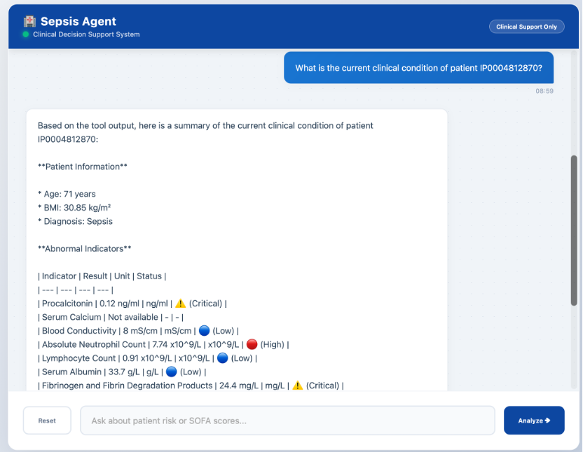
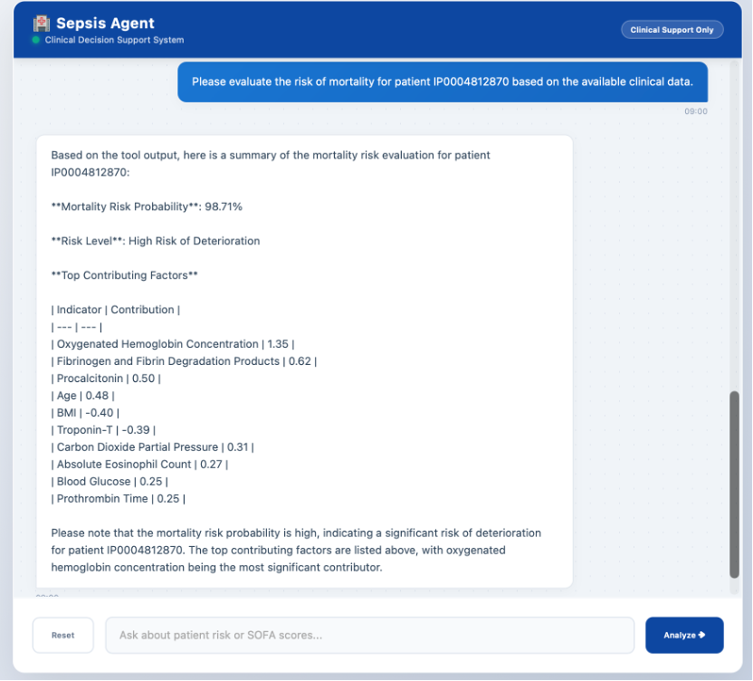

# Sepsis Clinical Decision Support System (Sepsis-CDSS)

<!-- 左右并排，保持两张图片大小一致 -->

  
  

**Sepsis-CDSS** is a web-based Clinical Decision Support System powered by a LangGraph agent. It provides real-time patient data analysis, AI-assisted guidance, and interactive session management.

---

## 🚀 Features

- **Direct Execution:** Start the app immediately with Python; no extra setup required.
- **Updated Data Integration:** Simplified and updated data connection method for testing.
- **Sample Data & Knowledge Base:** Includes partial patient test data and knowledge base data for easy testing.
- **Session Management:** Supports multiple user sessions with conversation history.

## 📋 Requirements

- Python 3.9+
- Flask
- Flask-CORS
- LangGraph & LangChain core libraries
- dotenv
